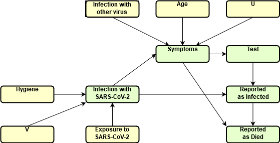

## Epidemiology

Inspired by the 2020 SARS-CoV-2 epidemic, let's have a look at a causal model for understanding the high-level epidemiological data that was widely discussed at the time. We want to focus on the causal mecheanisms that generate the number of reported infections and the impact on non-pharmacological interventions.
The model will illustrate that it is crucially important to understand the causal mechanisms when interpreting statistics, as differences (say across countries or compared between epidemics) might be misleading if this is not accounted for.

For simplicity, we will present the causal graph as a summary graph, where we neglect the inherent time structure of the mechanism. This does not cause any problems for causal reasoning, as the summary graph is still acyclic. However, to make inferences based on observed data, we will later on take a look at the full time graph as well.

### The reporting mechanism

extra text

We model the reporting mechanism as follows:

* for a person to be reported to be infected with SARS-CoV-2, there are two main causal influneces: whether the person is in fact infected with that virus and whether a PCR test was performed. If we assume that test used is perfect (i.e. has no type I error nor a type II error), we can model this relationship deterministically as $ReportedInfection := f(Test, Infection)$. Note that the assumption of a perfect test also allows us to disregard any causal influence from $OtherInfection$ to $ReportedInfection$, which would be the case if the test accidently would show positive outcomes in cases where the person does not have SARS-CoV-2, but a similar infection (e.g. other corona viruses).
* a person is tested for SARS-CoV-2 if they are symptomatic and/or have had recent contact with a person known to be SARS-CoV-2-positive. Again, for simplicity, we assume that this is a strict rule-based (and stable) mechanism.[^footnote-test-mechanism] The structural assigment is $Test := g(Symptoms, ContactInfected)$.

[^footnote-test-mechanism]: In reality, this assumption was violated. Over the course of the epidemic, testing capabilities have increased in most countries and tests have been expanded over time. In some countries and regions, asymptomatic persons have been tested as well, even if there was no known contact with another infected person. We discuss this in more detail when we take a look at the full time graph of the model.

* a person's symptoms are determined by them being infected by the SARS-Cov-2 virus, other viruses causing respiratory diseases, age, pre-existing conditions, as well as other unspecified and unobserved factors (e.g. genetics). The assignment is $Symptoms := h(Infection, InfectionOther, Age, PreCondition, U)$, and the assignment is probabilistic to to $U$ being treated as a noise term. As we define symptoms to include the value "death", this mechanisms has to fully explain a person's likelihood to die with and without the virus.

* the infection mechanism is modelled as a probablistic function of personal hygiene and exposure to the virus: $Infection := h(Hygiene, Exposure, V)$

* finally, a person is reported to have died of SARS-CoV-2 if the person has been positively tested for the virus and has died (one of the possible values of the symptom): $ReportedDeath := h(ReportedInfection, Symptoms)$. We assume this to be a simple and determinsitic mechanism.

#### Reasoning about interventions and counterfactuals
The model now allows us to reason about certain interventions that affect the reported numbers of infected and deceased.

##### No virus
The most important one is certainly the counterfactual question of what would happen if there were no SARS-CoV-2 virus out there, which serves as a baseline model that allows us to compare the pandemic situation to a "normal" one.
Technically, this amounts to replacing the assignment for variable $Infection$ to
\begin{equation}
Infection := 0
\end{equation}
As this is just a hypothetical intervention, let us assume that it is atomic, i.e. we assume that the rest of the model is not changed by this intervention. Most importantly, the assignment $Symptoms := h(Infection, InfectionOther, Age, PreCondition, U)$ is still in place, it's just that the value of one of the inputs is $0$ in the entire population.
As $Symptoms$ was defined to be a categorical variable including the value "death", we can use the model to compare two distributions in the population, one with and one without the virus. The difference tells us the additional deaths due to SARS-CoV-2 virus rather than just the numer of deaths associated with SARS-CoV-2 (which is what $ReportedDeath$ is capturing). This information is important because we ultimately want to understand how deadly the disease acutally is, i.e. how many deaths it causes, not just how prevalent it is in people how are dying. With the median age of reported deaths with the virus being at around 80 and the probability of a person at 80 to die within 12 months being at around 5%, this is non-negligible.

##### Changing testing strategy
expanding test capacities
comparing numbers across countries with (very) different test strategies
random testing

### Evolving Symptoms

To model the evolution of symptoms over time, we need to switch from a time series summary graph to a full time graph.
