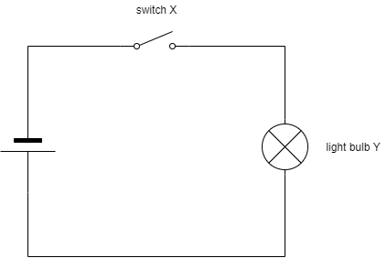
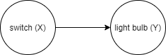
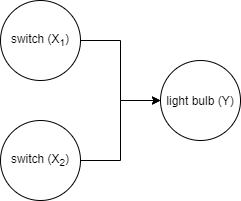
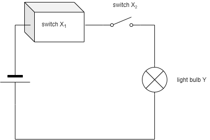

# Causal Models

## Causality, Asymmetry and Entropy

*Causality* is strongly linked to the concept of *time*. Cause precedes effect, never the other way round. Symptoms occur after infection
This asymmetry is mirrored in the physical notion of entropy and (as an emergent property) time.
While the past is determined we feel that we are able to act on the future, that we are able to choose one among many possible futures. This is due to the low entropy the universe had in the past.
All fundamental physical laws are perfectly symmetrical and therefore reversable. Asymmetry is only introduced by a coarse-grained look at the world, and therefore an *emergent* property.


## Basic Definitions
We assume the world can be modelled by *variables*. Variables can take various values. The variables themselves are denoted by upper-case latin letters, e.g. $X$, whereas we use lower-case letters for their values, e.g. $x$. In case $X$ is *categorical*, different values will be denoted by a subscript $x_j$. Where $X$ has two values only, we will encode them with $0$ and $1$.

### Causal Graphs

```{definition, graphs, name = "Causal Graph"}
A graph is a mathematical structure. It consists of a set of nodes and and a set of edges, where edges connect ordered pairs of nodes. In *causal graphs*, nodes represent variables; edges represent the causal relation from cause to effect. Note that in a causal graph, an edge is an *ordered* pair of nodes, the edge therefore directed. In most graphs in this book, we will consider causal systems that can be represeted as directed acyclical graphs (DAGs)[^dag1]. These DAGs have no feedback loops.
```

[^dag1]: Readers familiar with DAGs data processing pipelines will recognize that these too describe causal mechanisms. Datasets are manipulated in an ordered sequence of steps to produce a final outcome where the result of each step is determined by the outcome of its parents steps (the input datasets) and the mechanism itself (the transformation of the datasets).

The causal graphs convey the qualitative pattern of causal relations. They do not quantify that relation, i.e. specify how two variables are related. A graph with relation $A \rightarrow B$
It The quantitative aspects are better represented in a set of structural equations.

```{definition, exoendo, name = "Exogeneous and Endogeneous Variables"}
An exogeneous variable in a graph G has no edges pointing into itself.
An endogeneous variable in a graph G has at least one edge point into itself.
```

### Structural Equations

*Structural equations* represent the causal relations between *variables*. The *absence* of a variable from the model assumes that it is not relevant for the causal description of the system.
We will focus exposition on *categorical variables* which can assume a

$X \rightarrow Y$ means that $X$ causes $Y$. Manipulating $X$ determines the value of $Y$, but not the other way round. We call $X$ the *cause* and $Y$ the *outcome*. Others call $Y$ the "*effect*", but we will use *effect* to denote changes in the outcome due to manipulations of the cause. This is in line with conventions in statistical literature (e.g. "average treatment effect") and its usage in everyday language (e.g. "tipping on that button had no effect on the brightness of the screen").

## Simple Environments

### An electric circuit with one switch
Let's first take a look at a most simple environment, shown in figure xxx. It represents a circuit diagram with a voltage source, a switch (X) and a lamp (Y). Both, X and Y, can assume one of two states. We will encode these as 0 and 1:

* switch is open (0) or closed (1)
* light bulb is off (0) or on (1).



This system is very easy to reason about. Assuming that the power source has enough capacity, the light bulb will be on if and only if the switch is closed. The system can be in one of only two states:

| switch $X$ 	| light bulb $Y$ |
|-------------	|---------	|
| 0           	| 0       	|
| 1           	| 1       	|

This table, however, does not contain any information on the causal relationship between X and Y and will therefore not be sufficient to correctly reason about the system. Hence, let's take an extra second to translate this circuit diagram into a *causal graph*. This will become much more useful in more complex systems, but it's probably a good idea to get used to this representation from the start.



A *causal graph* represents variables as *nodes* and causal relationships as *directed edges* between nodes. $X \rightarrow Y$ means that $X$ causes $Y$. This in turn means that manipulating $X$ determines the state of $Y$, but not the other way round. Here, the graph consists of two nodes, the switch X and the light bulb Y, connected by a directed edge from X to Y.

While the graphical representation of the causal structure makes it easy to *qualitatively* reason about the causal structure of the system, an algebraic representation will be needed for quantitative analysis. The algebraic representation of a causal relationship is called a *structural equation*. In any system we have one structural equation for every node that has at least a cause.
In our case, only the light bulb Y has a cause and therefore we only have a single equation:
\begin{equation}
Y := f(X)
\end{equation}
where $f()$ is a function.
Note, that a *structural equation* uses "$:=$" rather than the usual "$=$". It should be read as "$f(X)$ is evaluated and *assigned* to $Y$". It resembles variable assignment in many programming languages where, for example, `x = x + 1` is a valid expression. Here too, the current value of `x` is incremented by 1 and then reassigned to `x`. Crucially, a *structural equation* is asymmetric, capturing the important distinction that X causes Y, but not the other way around.

In many applications, the goal is to identify $f()$. Here, however, our understanding of physics and the assumptions made about the system, allows us to infer $f()$ right away:
\begin{equation}
Y := f(X) = X
\end{equation}

#### Intervention

Now that we managed to represent this system in various forms, we can start to reason about *interventions*. For now, we define an *intervention* as an operation in the system that fixes a variable to a certain value. Here, two interventions are of interest: we can open the switch, i.e. set $X:=0$, or close it, i.e. set $X:=1$.  The *structural equation* is then
\begin{equation}
Y := f(X) = 0
\end{equation}
and 
\begin{equation}
Y := f(X) = 1
\end{equation}
respectively.

This simple system has a nice property: for the light bulb to be on, the closed switch is a *necessary* and *sufficient* condition. This property is "nice" as it allows us to falsify the causal model from observation: a *single* observation where the light bulb is on but the switch is open (or the light bulb is off but the switch is closed) allows us to refute the causal model, e.g. the power source might not be strong enough or the circuit might have flaws.

### An electric circuit with two switches

Let us now slightly increase the complexity of the system by adding a second switch. Both switches are connected in series as shown in the circuit diagram in figure XXX 


Again, our understanding of the physical nature of this system allow us to derive the corresponding causal graph. Both switches cause the state of the light bulb whereas the light bulb does not cause any of the switches and switch $X_1$ does not cause switch $X_2$, nor vice versa. Hence our causal graph has three nodes and directed edges $X_1 \rightarrow Y$ and $X_2 \rightarrow Y$:




The structural equation for this system is also very simple:
\begin{equation}
Y := f(X_1, X_2)
\end{equation}
but the functional form of $f()$ might not be obvious. The two switches allow the environment to be in four different states. Only if *both* switches are on, will the light bulb be on, in the other three states it will be off:

| switch $X_1$ 	| switch $X_2$ 	| light bulb $Y$  |
|-------------	|-------------	|---------	|
| 0           	| 0           	| 0       	|
| 0           	| 1           	| 0       	|
| 1           	| 0           	| 0       	|
| 1           	| 1           	| 1       	|

Hence, the structural equation has to be
\begin{equation}
Y := f(X_1, X_2) = X_1 \cdot X_2
\end{equation}

For the light bulb to be on, $X_1=1$ and $X_2=1$ are necessary conditions but neither is (on its own) sufficient.

#### Intervention

Let us now turn to interventions in this system. While in the system with just one switch, every intervention on $X$ caused a *change* in the state of $Y$, this is not true in the case of interventions on a single switch now. In a state where $X_1 = 0$, we are unable to change the state of $Y$ by intervening on $X_2$:
\begin{equation}
Y := f(0, X_2) = 0 \cdot X_2 = 0
\end{equation}

Conversely, if the first switch is closed, $X_1 = 1$, we're basically back in a system with just one switch, which solely determines by the state of the light bulb.
\begin{equation}
Y := f(1, X_2) = 1 \cdot X_2 = X_2
\end{equation}

## Unobservability

So far, we were able to reason about the effectiveness of interventions due to our ability to fully specify the structural equations (i.e. we knew $f()$) *and* were able to *observe* the state of all causes. This allowed us to reason that closing switch 2 will *not* have an effect on the light bulb when switch 1 is open, but will change its state if switch 1 is closed.

Problems arise, when one of these conditions fails. Suppose we are still dealing with the system with two switches connected in series, but the state of switch 1 cannot be observed as the switch is hidden in a box, see figure XXX.



Imagine now that we observe that switch 2 is open (and the light bulb is off). Will closing switch 2 turn on the light?

Unfortunately, we are not any more able to answer this question. Our best answer is "It depends.". It depends on the state of switch 1, which is not observable. What were left is to resort to a different kind of reasoning, *probabilistic* reasoning. While we're not able to make any statements about any single system of that kind, we can still make statments on the likelihood of $X_2$ effectiveness based on probability distributions for $X_1$. If we knew that the likelihood that switch 1 is closed is 0.8 in all cases where we encounter switch 2 to be open and and the light to be off, then closing switch 2 will turn on the light in 80% of the cases.

### Probabilistic Models of Causality
This example has shown that even in very simple causal systems, not being able to observe (or accurately measure) a single variable requires us to revert to inferences of a lesser kind, *probabilistic* rather than *determinstic*. Of course, outside of physics, most systems worth studying are far more complex as the one described here, and many variables of (potential) interest cannot be observed or measured. Causal reasoning in social sciences, medicine and other complex sciences is therefore closely linked with probability theory. Hence, from here on, we will consider these probabilistic use cases.

### Interventions More Generally Defined

So far, we have used the term *intervention* when we fixed a variable of system to a certain value. More generally, an intervention is a change in one or more structural equations. An intervention that replaces the right-hand side of the structural equation with a *value* is called *hard intervention* (or *atomic*, *ideal*, *surgical*), whereas a replacement with another function with the same arguments is called a *soft intervention* (or *imperfect*, *parametric*) ([@pearl2009, p.35] and [@pearl2009, p.89])

We already encountered examples for hard interventions, like closing switch $X_1$:
\begin{equation}
X_1 := 1
\end{equation}.

A soft intervention would be a rearrangment of the circuit, so $X_1$ and $X_2$ are placed are placed in parallel rather than in series. The state of the light bulb would still depend on both $X_1$ and $X_2$, but the assignment functions would be more like this:
\begin{equation}
Y := g(X_1, X_2) = I(X_1 + X_2 >= 0)
\end{equation}
where $I(a)$ is the indicator function that returns 1 if $a$ is true and 0 otherwise. In a parallel arrangement it is sufficient that *any* of the two switches is closed:

| switch $X_1$ 	| switch $X_2$ 	| light bulb $Y$  |
|-------------	|-------------	|---------	|
| 0           	| 0           	| 0       	|
| 0           	| 1           	| 1       	|
| 1           	| 0           	| 1       	|
| 1           	| 1           	| 1       	|

## Complex Environments

### An electric circuit with two switches, one unobserved
Let us start with the problem above, where we model a system with two switches, but the state of switch one is unobserved. To make the distinction between the two switches more apparent, let's denote the unobserved switch by $U$ and the observable switch simply by $X$:


Note that the *structure* of the causal graphs remains the same, as the box only hinders us to observe the *state* of the switch, but we still know that there is a switch. This allows us to further specify $f()$ of the structural equation, which after refactoring variable names is now
\begin{equation}
Y := f(U, X) = X \cdot U
\end{equation}

Let us further introduce a symbol for the system itself, $S$, which not only denotes the structure of the system, but includes the probabilistic mechanism that determines $U$. We can now *derive* the *probability distributions* for $Y$ from the structural equation for each possible interventions on $X$:

\begin{equation}
P^{S;do(X:=x)}(Y=y) = P^{S;do(X:=x)}(X \cdot U = y) = P^{S;do(X:=x)}(x \cdot U) = x P^{S;do(X:=x)}(U)
\end{equation}
where $do(X:=x)$ denotes the intervention on $X$ where its state is set to $x$. Note that, as the intervention fixes $X$ to a specific value, it is non-random and can therefore be placed outside of $P()$.

Causal reasoning about the effect of the switch on the light bulb (the effect of setting the state of $X$ on the state of $Y$) now depends not on the state of $U$, but its probability distribution. We can safely say that, if we open the switch, then the light bulb will never be on, regardless of the probability distribution of $U$:
\begin{equation}
P^{S;do(X:=0)}(Y=1) = 0 \cdot P^{S;do(X:=0)}(U) = 0
\end{equation}
Again, if we were to observe a case where the switch is open but the light bulb is on, we would instantly know that our structural equation is invalid.

This is different however for the case where we close the switch:
\begin{equation}
P^{S;do(X:=1)}(Y=1) = 1 \cdot P^{S;do(X:=1)}(U=1) = P^{S}(U=1)
\end{equation}

Say, for example, system $S$ refers to a population of circuits that are all created by the same machine. This machine is supposed to close the switch in the box, but fails to do so 1% of the cases. Hence, $P^{S}(U=1)=0.99$ and therefore $P^{S;do(X:=1)}(Y=1)=0.99$: only in 99% of the cases where we close the switch, we will see the light bulb go on, in 1% of the cases it will fail to do so.


###
\begin{equation}
\Delta_i := Y_i^{S;do(Z_i:=1)} - Y_i^{S; do(Z_i:=0)} \label{eq:myfirsteq} \tag{1}
\end{equation}

As $Y$ is binary, $\Delta$ can be one of ${-1, 0, 1}$ with $\Delta = 1$ being the desired outcome. As discussed in [causality], we are not able to measure this quantity directly, but need to resort to population-level quantities instead:
\begin{equation}
P(\Delta) = P^{S;do(Z:=1)}(Y) - P^{S;do(Z:=0)}(Y) \label{eq:mktg_pop_ate} \tag{2}
\end{equation}

## Causal Effects

The fundamental problem of causal inference

The definition of [causal effect] hints at a severe problem for its measurements. It involves two quantities which can never be observed at once. This poses a severe problem, often called **the fundamental problem of causal inference**.
Nevertheless, it does not prevent us from inferring *average* causal effects. This might be counterintuitive at first. How could we measure the *average* of a quantity, if we can't measure the quantity itself? We will see that statistics comes to the rescue. The linearity of expectation states that

\begin{equation}
E(U - V) = E(U) - (V)
\end{equation}
i.e. expected value of the difference of two random variables is the difference between the expected values of the individual random variables. Hence, even if $U - V$ cannot be observed, we can still calculate.[^linexpex1]

[^linexpex1]: Imagine you are interested in the average *net income* of a certain population, i.e. $E(income - expenses)$. Even if you do not have access to individual-level data, say due to privacy concerns, you can calculate this value if you are given the population averages of income and expenses, i.e. $E(income) - E(expenses)$. Note that linearity is a property of the expected value, but not of other aggregate metris that might be of interest like the median value, where, in general, $Median(income - expenses) \neq Median(income) - Median(expenses)$.

### Definition

bla

### Causal Effect Statistics

```{definition, ate, name = "Average Treatment Effect"}
The Average Treatment Effect, or ATE, is the expected value of xx in population x.
```

bla bla bla

```{definition, att, name = "Average Treatment Effect on the Treated"}
The Average Treatment Effect on the Treated, or ATT, is the expected value of xx in population x conditional on observing x.
```

It is often used in situations where the treatment effect is expected to be heterogeneous in a population. In a given environment, selection into treatment could yield treated individuals to have a different average treatment effect than the total population. For example, if university eduction has a higher effect on earnings for people with high intelligence and if people with high intelligence more often chose a university education than less intelligent ones, the average effect of university eduction of those who choose to go to university will be higher than in the overall population (and therefore than those choosing not to go to university).


```{definition, itt, name = "Intention To Treat Effect"}
The Intention To Treat Effect, or ITT, is the expected value of xx in population x.
```

It is conceptually the same as the ATE, but often refers to a situation where the primary intervention cannot be manipulated directly, e.g. where a doctor can prescribe a drug but not enforce that the patient actually takes the drug.


```{definition, late, name = "Local Average Treatment Effect"}
The Average Treatment Effect, or ATE, is the expected value of xx in population x.
```
