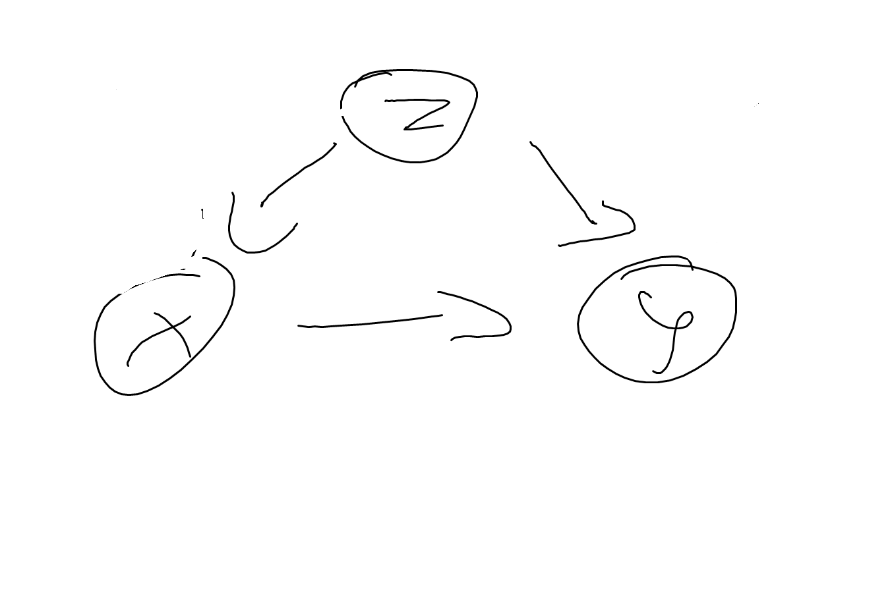

# Methods for Causal Inference

Causal relations can be inferred from **experiments** as well as **observational studies**.
The randomized controlled experiment is a proven method to infer causal relations in complex environments. It involves full control over the assignment mechanism and the assignment is random.
A common variation is the situation where the variable of interest cannot be directly intervened on, but a causal parent can. For example, a doctor can (randomly) prescribe a certain drug, but the patient still chooses to take the drug or not. The method of instrumental variables allows us to infer (local) causal effects nevertheless.

Afterwards, we switch to those methods that can be used even if we cannot intervene in the environment, but have to rely on passive observation only. Inferring causal relations in these situations requires a thorough understanding of the causal links from the variable of interest to the effect. We will study two different inference strategies which rely on different sets of assumptions.

Finally, we discuss methods for causal inference in samples of size 1. Given appropriate assumptions, we are able to infer causal relations by leveraging (dependent) observations over time.

## Causal vs Statistical Inference
Inferring causal mechansims from data is more difficult than learning about properties of the distribution of variables:

* Being able to infer causal mechanisms from data requires knowledge about the data generating process which cannot be inferred from the observed data itself. Observed data can help us justifying assumptions on the causal structure we are willing to accept, but it cannot fully specify the causal model in any application of interest. Hence, we will always have to incorporate (domain) knowledge to enrich the observed data before we can make causal inferences.
* Causal inference does not get rid of the typical statistical problems. These are still there and need to be solved. The causal problems are just an additional layer on top.

The causal structure implies statistical dependencies. If observations violate the implied dependencies, the causal structure cannot be correct. In practice, observing two variables to be statistically dependent these variables either have a common cause or they directly cause each other. There are practical limitations though:

* this only holds true for i.i.d. variables. if the observed data is a time series, this property does not hold. hence, time series observations might be statistically dependent, although there is no causal link. a common phenomenon is that two variables are *trending* over time. As an effect, observations from such time series will likely have a very high correlation, despite them being causally independent.[^ts-analysis-econ]

* our ability to correctly infer statistical dependence might not be straightforward:
  * if our analysis involves many variables, the number of tests necessary to establish conditional dependence between any pair of two variables increases swiftly. Maintaining a fixed type I error for independence will become exceedingly difficult. We may then falsely identify two variables as being dependent.[^hte-error-control]
  * we might not be able to observe (a random sample of) the outcomes of a causal mechanism, but only a biased one. this is commonly referred to as selection bias (or survivalship bias) in the literature. See also https://xkcd.com/1827/

[^ts-analysis-econ]: As most (macro-)economic data are time-series, the econometrics literature is full of methods to establish causality in time-series. Most of it goes beyond the description provided in section xxx but unfortunately there are currently on few sources that cover this material in the language and notation of causality adopted here. See also https://xkcd.com/925/.

[^hte-error-control]: This problem is common in the search for heterogeneity in treatment effects, where e.g. the effectiveness of drug is broken down by patient groups (e.g. male vs female, with prior indication vs without). If the number of groups available to the researcher increases, the likelihood of a false discovery increases without proper control. See also https://xkcd.com/882/.

### Example 1 Tutoring
Let us first explore a simple but insightful DAG and reason about interventions and causal effects. Assume the model for the causal relationship between grade $Z$, tutoring $Y$ and passing the final exam $Y$ is as shown in DAG XXX.



More precisely, let's first look at a deterministic quantitative relation given by

\begin{align}
X &:= I(Z >= 4) \\
Y &:= I(Z < 5 \text(or) (Z = 5 and X = 1))
\end{align}
i.e. all students with grades 4, 5 or 6 get tuturing (but no students with grades 3 or better); students with grades 4 or better are all passing the exam, whether or not getting tutored, as well as tutored students with grade 5; untutored students with grade 5 are failing the test as well as all students with grade 6 (tutored or not).
This system is already insightful to show that the causal model entails *multiple* probabilistic models. First, note that we do not observe any students with grade 5 who fail the test and that every failed student had grade 6. The observed conditional expected values for $Y|Z$ are given in table xx.
Second, we can tell what will happen if we intervene in one or more mechanisms. If we, for example, restrict tutoring to students with grade 6, i.e. $X &:= I(Z >= 6)$, all students with grade 5 will fail the exam as well as those with grade 6. But nothing will change for students with grade 4, they still will all pass the exam. Without knowing the causal mechanism, the different behavior of stundents with grade 4 and 5 could not have been predicted. In the observed data, both groups were not distinguishible, neither their relation to tutoring (all got tutored) nor by their exam performance (all passed the exam).

Let's now make this example a bit more interesting (and slightly more realistic) by abandoning the deterministic nature of the mechanism and using a probabilistic one instead. The graph is then to be xxx.


## Randomized Controlled Experiments

TODO

### Assignment Mechanisms

```{definition, rct_assignment, name = "Complete Randomization"}
If intervention $X$ is assigned through mechansim
\begin{equation}
X := U
\end{equation}
where $U ~ Bernoulli(p)$ with $0 < p < 1$, the experiment is said to be completely randomized.
```

text

```{definition, strat_assignment, name = "Stratified Randomization"}
tbd
```

Stratified experiments first group individuals according to some observable attribute (e.g. by gender or by city). These groups are called strata. Within each stratum, treatment assignment follows a copmpletey randomized experiment. All methods for statistical inference can be used if the stratum is interpreted as the population for each sub-experiment. In many cases, however, we're not primarily interested in the effect in each stratum (although this can be informative) but in the population containing all strata. The statistics become more cumbersome, but stratification imposes no harm in the sense of additional assumptions as the stratification mechanism is fully known.


## Instrumental Variables

In many practical applications, the assignment cannot be enforced, e.g. patients assigned to take a drug might choose to not follow through. In these cases, the effect of assignment and the effect of the actual treatment (the drug) will be different. A drug might be effective, if the application is difficult, many patients might choose not to follow through. A less effective drug that is easier to apply might have overall higher effectiveness of the assignment.

We can extend graph x from the previous section to show this mechanism explicitly. So far, we have focused on the effect of $X$ on $Y$, ignoring the details of the mechanism, especially that $Z$, the patient's decision to follow the assignment, is a *mediator* of the effect of $X$ on $Y$. This is not a problem if the effect of $X$ on $Y$ is our primary interest. However, we might be interested to split this mechanism into two sub-mechanisms in their own right. The mechanism $X -> Z$ explains how assignment of treatment is followed through by patients, whereas $Z -> Y$ is the biochemical of the drug. Often, researchers are interested in the latter, but aren't able to enforce assignment. As $U$ is a confounder of $Z -> Y$, the correlation of $Z$ and $Y$ is not a valid method to estimate the causal effect. In comes the instrumental variable, in this case $X$.
The intuition behind this method is as follows. We can reliably infer the effect of $X$ on $Y$, as $X$ is randomized and therefore there is no confounding. We can further also infer the effect of $X$ on $Z$, again because $X$ is randomized. In a sense, as $X$ on $Y$ is the combined effect of $X$ on $Z$ and $Z$ on $Y$, there are ways we can get the latter from the former two (it is, in general, not just the difference of these two).

TODO

## Propensity Score Matching

Many questions cannot be answered with deliberate experiments. Experimentation might be considered unethical or unfeasible; the intervention has already been done without randomization;
TODO

## Difference-in-Difference Estimator

TODO

## Time Series Methods

TODO
